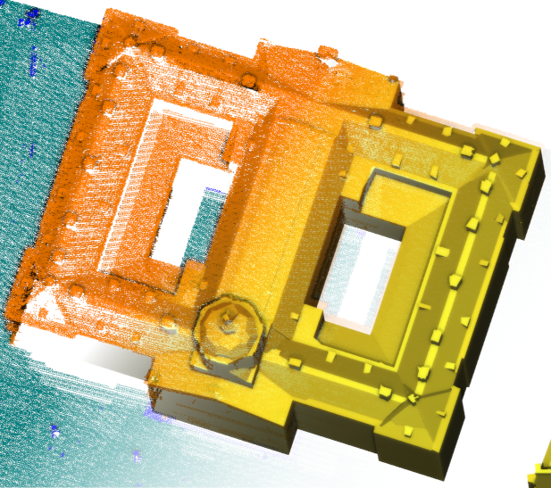
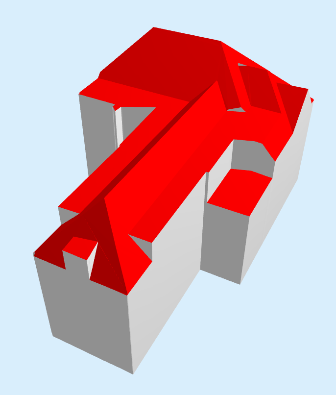

# Automated 3D building reconstruction from point clouds



*A tool for reconstructing 3D building models from point clouds, fully automated, with high-detail. Free and open-source.*

## TLDR;
[Install](https://github.com/geoflow3d/geoflow-bundle/releases) and run from your terminal
```shell
lod22-reconstruct --input_footprint=my_footprint.gpkg --input_pointcloud=my_pointcloud.las
```
and enjoy the output files that are created.

## What does it do?

+ Takes the point cloud and the 2D polygon of a *single* building and generates a 3D model of the building. It is a fully automated process, there is no manual intervention.
+ It is possible to tweak the reconstruction parameters to adjust it a little to different input data qualities.
+ Outputs a model as a simple extrusion, in LoD1.2, LoD1.3, LoD2.2. See [the refined Levef of Details by the 3D geoinformation research group ](https://3d.bk.tudelft.nl/lod/).
+ For LoD2.2, it generates the model with as much detail in the roof structure as there is in the point cloud.
+ It generates the required [Semantics](https://www.cityjson.org/specs/1.1.1/#semantics-of-geometric-primitives) for the surfaces.
+ It outputs to formats like Wavefront OBJ, GeoPackage, CityJSON or a PostgreSQL database.

## Requirements on the input data

### Point cloud

+ Acquired through aerial scanning, either Lidar or Dense Image Matching. But Lidar is preferred, because it is often of higher quality. Thus point clouds with only building facades eg. mobile mapping surveys are not supported.
+ The fewer outliers the better.
+ Classified, with at least *ground* and *building* classes.
+ Has sufficient point density. We achieve good results with 8-10 pts/m2 in the [3D BAG](https://3dbag.nl).
+ Well aligned with the 2D building polygon.
+ Do include some ground points around the building so that the software can determine the ground floor elevation.
+ Pointcloud is automatically cropped to the extent of the 2D building polygon.
+ In `.LAS` or `.LAZ` format.

### 2D building polygon

+ A simple 2D polygon of a single building.
+ Preferably roofprint, since the input point cloud was also acquired from the air.
+ Well aligned with the point cloud.
+ In GeoPackage or ESRI Shapefile format, or a PostGIS database connection.

## Installation

### Using the binary packages
It will probably be easiest to use one of the binary packages on the Release page (docker, windows installer) as explained below. In case you are on windows, the **cli** version is recommended.

### Building from source
In case you can not or do not want to use the binary packages, you can also build everything from source. This is only recommended if you know what you are doing, ie. have experience in compiling software.

> **Note:** macOS is currently untested

So only in case you want to compile the software from scratch you need to clone this repository with all of its submodules, eg:

```shell
git clone --recurse-submodules https://github.com/geoflow3d/geoflow-bundle.git
mkdir build && cd build
nix develop --ignore-environment
cmake .. -DGF_BUILD_GUI=OFF -DCMAKE_INSTALL_PREFIX=~/.geoflow
cmake --build . --config Release --parallel 4
cmake --install .
```

Before compiling this software you will need to install the various dependencies. Please refer to the README's of the respective submodules in this repository for more information.

## Usage

Two things are needed for running the reconstruction on some input data.
1. A *flowchart* that contains the logic of the reconstruction and describes how the various components (plugins and nodes) connect. The *flowchart* is a JSON file.
2. The *geoflow* executable (`geof`), which executes the logic in flowchart.

```shell
geof flowchart.json
```

Use `geof --help` to see the detailed help.

```shell
Usage:
   geof [-v|-p|-n|-h]
   geof <flowchart_file> [-V] [-g] [-w] [-c <file>] [--GLOBAL1=A --GLOBAL2=B ...]

Options:
   -v, --version                Print version information
   -p, --list-plugins           List available plugins
   -n, --list-nodes             List available nodes for plugins that are loaded
   -h, --help                   Print this help message

   <flowchart_file>             JSON flowchart file
   -V, --verbose                Print verbose messages during flowchart execution
   -g, --list-globals           List available flowchart globals. Cancels flowchart execution
   -w, --workdir                Set working directory to folder containing flowchart file
   -c <file>, --config <file>   Read globals from TOML config file
   --GLOBAL1=A --GLOBAL2=B ...  Specify globals for flowchart (list availale globals with -g)
```

### Globals

A flowchart can contain some parameters that are set for the whole flowchart. These are called *globals*
To see the global parameters of a flowchart and their explanation pass the `--list-globals` option.
```shell
geof flowchart.json --verbose --list-globals
```
An example of the flowchart globals printed by `--list-globals`:
```shell
Available globals:
 > building_identifier [Unique identifier attribute present in input footprint source]
   default value: "fid"
 > input_footprint [Input 2D vector file with building footprint(s)]
   default value: ""
 > input_footprint_select_sql ["OGR SQL statement to select one input footprint from the input_footprint file, eg \"fid=47\"]
   default value: "fid=47\"
...
```

You can set the value of one or more flowchart global parameters from the commandline.
For instance, set the `building_identifier` and `input_footprint` parameters.

```shell
geof flowchart.json --input_footprint=/some/path/file.gpkg --building_identifier=gid
```

In addition to the command line, you can also set the global parameters in a TOML configuration file.

```toml
# contents of config.toml
input_footprint="/bla/file.gpkg"
building_identifier="gid"
```

```shell
geof flowchart.json --config config.toml
```

#### Order of priority

It is possible to set the global parameters in three different places and their order of priority is as follows:

1. parameters passed in the command line
2. parameters set in a TOML configuration file
3. parameters stored in the flowchart

Thus, a parameter set in the command line has the highest priority and overrides the value set in any other location.

### Building reconstruction

The flowchart of the building reconstruction is in `flowcharts/gfc-brecon/single/reconstruction.json`.
You need to use this flowchart to generate the 3D building models.
However for you convenience we automatically install this flowchart and the script `lod22-reconstruct` to easily run it.
The command `lod22-reconstruct` (`lod22-reconstruct.bat` on windows) is an alias for `geof long/path/reconstruction.json`.

Download the [test data](https://data.3dgi.xyz/geoflow-test-data/wippolder.zip) and unzip into a `test-data` directory.
Then run:

```shell
lod22-reconstruct \
  --input_footprint=test-data/wippolder.gpkg \
  --input_pointcloud=test-data/wippolder.las \
  --config test-data/config.toml
```

Here we override the default values that are set in the flowchart.
The `input_footprint` and `input_pointcloud` are passed directly in the command line.
In addition, the `input_footprint_select_sql='fid=47'` (to select the 47th feature from the input footprint file) is read from the config file `config.toml`.

Combining the command line parameters and the config file allows you to keep the parameters that don't change with each model in the configuration file, while passing input and output parameters in the command line.

By default the output is saved to the `output` directory.
By default the output is generated in CityJSON, Wavefront OBJ and GeoPackage formats.
To omit an output format leave the corresponding output parameter empty (see `lod22-reconstruct -g`).

It is possible to save the model to a PostgreSQL database instead of a GeoPackage.
To write to a database, you need to pass a [GDAL-style database connection string](https://gdal.org/drivers/vector/pg.html#connecting-to-a-database) and set the output format to `PostgreSQL`.

```shell
geof single/reconstruct.json --output_ogr="PG:dbname=test" --output_ogr_format="PostgreSQL"
```



To run the reconstruction with your own data, set the global parameters as explained above.
Make sure that you have prepared your input data according to the *Requirements on the input data*.

### Running the building reconstruction with Docker

Download the and load the docker image from the Releases page.

The flowcharts that are needed for the building reconstruction are packaged into the docker images for convenience.
Thus, you only need to update the global parameters when running a container so that the correct input and output paths are set.

If you write the results back to the docker host, make sure that the target directory is writable by all.
For instance in Linux you would do:

```shell
mkdir output_docker
chmod a+w output_docker
```

#### All LoD-s

The following is an example for running the building reconstruction on the test data.
No need to pass the flowchart, because the image already contains it.

```shell
docker run \
  --rm \
  --network=host \
  -v "flowcharts/gfc-brecon:/data" \
  geoflow3d/lod22-reconstruct:latest \
  --input_footprint=/data/test-data/wippolder.gpkg \
  --input_pointcloud=/data/test-data/wippolder.las \
  --output_cityjson=/data/output_docker/model.json \
  --output_ogr=/data/output_docker/model_2d.gpkg \
  --output_obj_lod12=/data/output_docker/model_lod12.obj \
  --output_obj_lod13=/data/output_docker/model_lod13.obj \
  --output_obj_lod22=/data/output_docker/model_lod22.obj
```

#### LoD1.3 only
The building reconstruction tool for LoD1.3 models is packaged into a docker image, `geoflow3d/lod13tool`.
An example command to run the reconstruction in a new container from the image and write the results to a database on the host:

> **NOTE:**
> the flowchart underpinning lod13tool works very different from the standard one. It is not recommended to use unless you know what you are doing.

```shell
docker run \
  --rm \
  --network=host \
  -v /my/dir/data:/data/in_out_data \
  geoflow3d/lod13tool:latest \
  --config config.toml
```

## Citation

If you use the software in scientific publications, please see CITATION.bib

## About Geoflow

This software was mostly developed by Ravi Peters, and now also by Balazs Dukai. Geoflow was originally developed during our time at the [3D geoinformation research group](https://3d.bk.tudelft.nl/) at the Delft University of Technology. We are currently working on this software from the company [3DGI](https://3dgi.nl/), a spin-off of said research group.

In case you have the need for professional support (SLA), consultancy, or the implementation of custom features don't hesitate to drop us a line at info@3dgi.nl
